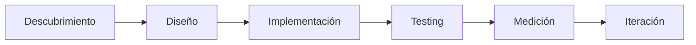

# Sebastián · Ingeniero de Software y Datos

  

  
  
  

  <a href="#propuesta-de-valor">Valor</a> •
  <a href="#stack-principal">Stack</a> •
  <a href="#proyectos-destacados">Proyectos</a> •
  <a href="#estad%C3%ADsticas-de-github">Estadísticas</a> •
  

## 🎯 Propuesta de valor

Ingeniero en Informática orientado a resultados de negocio, combinando **análisis de datos**, **arquitectura backend** y **calidad de software** para convertir requerimientos en soluciones mantenibles y medibles.

## 👨‍💻 Perfil profesional

- Especialización: Ciencia de Datos, Backend y QA.
- Formación: Ingeniería en Informática (DuocUC), mención en Ciencia de Datos.
- Experiencia en entornos corporativos y proyectos de seguridad/retail tech.
- Idiomas: Español (nativo) e Inglés (intermedio-alto).

## ✅ Qué puedes esperar de mi trabajo

- Entregables claros: documentación, código mantenible y criterios de calidad definidos.
- Comunicación activa: avances visibles, riesgos identificados y decisiones técnicas justificadas.
- Enfoque en impacto: priorización por valor de negocio y mejora continua basada en métricas.

## 🧰 Stack principal

> Perfil en crecimiento constante: base técnica amplia y especialización progresiva en desarrollo backend, mobile y analítica.

| Nivel | Tecnologías |
|---|---|
| Intermedio (en uso activo) | TypeScript, Django, SQL, Python |
| En progreso (foco actual) | Kotlin, Dart (Flutter), Go, Ruby |
| Base funcional | JavaScript, Lua, APIs REST, Docker, GitHub |

**Áreas de aplicación**
- Backend: diseño de APIs, estructura de proyectos y buenas prácticas de mantenibilidad.
- Datos: modelado, análisis estadístico y apoyo a decisiones con BI.
- Calidad: testing, documentación técnica y mejora continua.

## 🧩 Especialidades

### Ciencia de Datos
- Inteligencia de Negocios
- Modelado y análisis de datos
- Visualización y storytelling con datos
- Análisis estadístico aplicado

### Desarrollo de Software
- Diseño de arquitectura backend
- APIs robustas y mantenibles
- Aseguramiento de calidad y testing
- Versionado y colaboración técnica

### Gestión Técnica
- Trabajo ágil (Scrum/Kanban)
- Levantamiento y refinamiento de requerimientos
- Documentación técnica clara
- Enfoque en mejora continua

## 🚀 Proyectos destacados

- [proyecto-analisis-datos](https://github.com/seba3567/proyecto-analisis-datos): análisis y visualización para soporte de decisiones.
- [sistema-seguridad](https://github.com/seba3567/sistema-seguridad): backend modular con foco en confiabilidad y QA.
- [Ver todos mis repositorios](https://github.com/seba3567?tab=repositories).

### Caso 1 · Analítica de datos
- **Problema:** dispersión de datos y baja visibilidad para toma de decisiones.
- **Solución:** pipeline de análisis + dashboards orientados a KPIs críticos.
- **Resultado esperado:** decisiones más rápidas y trazabilidad de métricas clave.

### Caso 2 · Sistema de seguridad
- **Problema:** necesidad de backend confiable y controlado en entorno crítico.
- **Solución:** arquitectura modular con validaciones, API robusta y foco en QA.
- **Resultado esperado:** mayor estabilidad operativa y menor riesgo de fallas.

## 🧠 Método de trabajo

```mermaid
flowchart LR
    A[Descubrimiento] --> B[Diseño]
    B --> C[Implementación]
    C --> D[Testing]
    D --> E[Medición]
    E --> F[Iteración]
```

## 📈 Actividad en GitHub

  
  
  

## 🤝 Colaboración

Estoy abierto a colaborar en proyectos de:
- Ingeniería de datos y automatización de reportes.
- Backend con APIs escalables.
- Optimización de procesos técnicos con foco en impacto de negocio.

Si te interesa colaborar, puedes revisar mis repositorios o escribirme por GitHub.

  

