# Ingeniero de Software Especializado en Datos

<div align="center">
  
</div>

<p align="center">
  <a href="https://github.com/seba3567?tab=repositories">
    
  </a>
  <a href="https://github.com/DuoucInginformatica">
    
  </a>
  <a href="#">
    
  </a>
</p>

## 👨‍💻 Sobre mí

```typescript
const sobreMi = {
  especialización: ["Ciencia de Datos", "Desarrollo Backend", "QA"],
  educación: {
    grado: "Ingeniería en Informática",
    institución: "DuocUC",
    especialización: "Ciencia de Datos (2025)",
  },
  experiencia: ["IBM", "Soluciones de Seguridad", "Retail Tech"],
  idiomas: ["Español (Nativo)", "Inglés (Intermedio-Alto)"],
  pasión: "Transformar datos en soluciones de negocio con código limpio"
};
```

## 🛠️ Tech Stack

<table align="center">
  <tr>
    <td align="center" width="96">
      
      <br>Python
    </td>
    <td align="center" width="96">
      
      <br>JavaScript
    </td>
    <td align="center" width="96">
      
      <br>SQL
    </td>
    <td align="center" width="96">
      
      <br>Django
    </td>
    <td align="center" width="96">
      
      <br>GitHub
    </td>
    <td align="center" width="96">
      
      <br>Docker
    </td>
    <td align="center" width="96">
      
      <br>TypeScript
    </td>
    <td align="center" width="96">
      
      <br>API
    </td>
  </tr>
</table>

## 📊 Especialidades

<div class="skills-container">
  <div class="skill-category">
    <h3>🔍 Ciencia de Datos</h3>
    <ul>
      <li>Inteligencia de Negocios</li>
      <li>Modelado y Análisis de Datos</li>
      <li>Visualización de Datos</li>
      <li>Análisis Estadístico</li>
    </ul>
  </div>

  <div class="skill-category">
    <h3>💻 Desarrollo</h3>
    <ul>
      <li>Arquitectura de Software</li>
      <li>Aseguramiento de Calidad</li>
      <li>Control de Versiones</li>
      <li>Sistemas Linux/Windows</li>
    </ul>
  </div>

  <div class="skill-category">
    <h3>📈 Gestión</h3>
    <ul>
      <li>Metodologías Ágiles/Scrum</li>
      <li>Análisis de Requerimientos</li>
      <li>Gestión de Proyectos TI</li>
      <li>Documentación Técnica</li>
    </ul>
  </div>
</div>

## 🚀 Proyectos Destacados

<a href="https://github.com/seba3567/proyecto-analisis-datos">
  
</a>
<a href="https://github.com/seba3567/sistema-seguridad">
  
</a>

## 🧠 Enfoque Profesional

```mermaid
graph LR
    A[Análisis] --> B[Diseño]
    B --> C[Implementación]
    C --> D[Testing]
    D --> E[Optimización]
    E --> A
    style A fill:#5C85DE,stroke:#4A67BD,color:white
    style B fill:#5C85DE,stroke:#4A67BD,color:white
    style C fill:#5C85DE,stroke:#4A67BD,color:white
    style D fill:#5C85DE,stroke:#4A67BD,color:white
    style E fill:#5C85DE,stroke:#4A67BD,color:white
```



## 📈 Estadísticas GitHub

<div align="center">
  
  
</div>

<p align="center">
  
</p>
